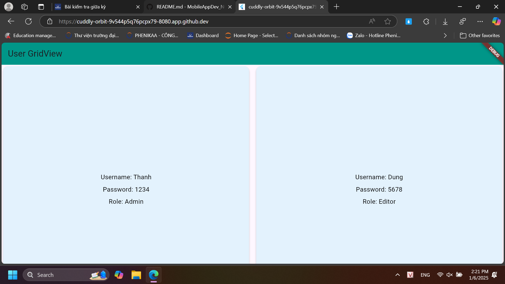
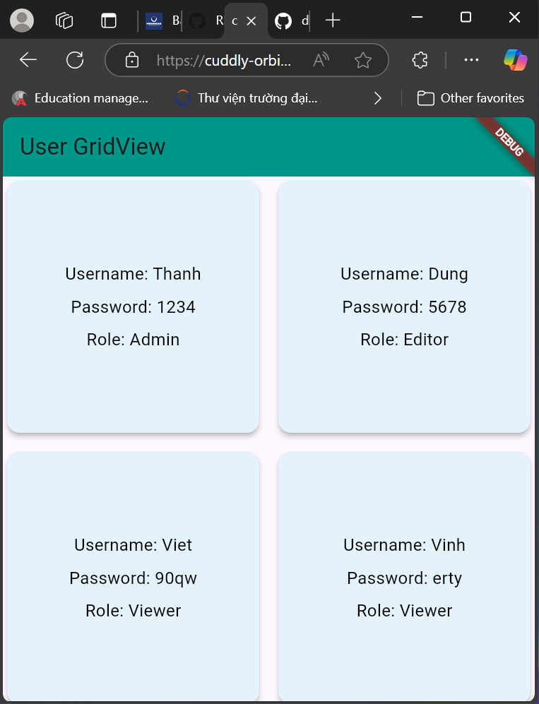

# User GridView App
Hiển thị danh sách người dùng theo dạng GridView

## Code gồm
### File `User.dart`
```dart
class User {
  String username;
  String password;
  String role;

  User({required this.username, required this.password, required this.role});

  @override
  String toString() {
    return 'User(username: $username, role: $role)';
  }
}

List<User> userList = [
  User(username: "Thanh", password: "1234", role: "Admin"),
  User(username: "Dung", password: "5678", role: "Editor"),
  User(username: "Viet", password: "90qw", role: "Viewer"),
  User(username: "Vinh", password: "erty", role: "Viewer"),
  User(username: "Hieu", password: "uiop", role: "Viewer"),
];
```
    
### File `main.dart`
```dart
import 'package:flutter/material.dart';
import 'user.dart';

void main() {
  runApp(MyApp());
}

class MyApp extends StatelessWidget {
  @override
  Widget build(BuildContext context) {
    return MaterialApp(
      home: UserGridScreen(),
    );
  }
}

class UserGridScreen extends StatelessWidget {
  @override
  Widget build(BuildContext context) {
    return Scaffold(
      appBar: AppBar(
        title: Text('User GridView'),
        backgroundColor: Colors.teal,
      ),
      body: GridView.builder(
        gridDelegate: SliverGridDelegateWithFixedCrossAxisCount(
          crossAxisCount: 2,
          crossAxisSpacing: 10,
          mainAxisSpacing: 10,
        ),
        itemCount: userList.length,
        itemBuilder: (context, index) {
          final user = userList[index];
          return Card(
            elevation: 4,
            color: Colors.blue[50],
            child: Padding(
              padding: const EdgeInsets.all(8.0),
              child: Column(
                mainAxisAlignment: MainAxisAlignment.center,
                children: [
                  Text(
                    'Username: ${user.username}',
                    style: TextStyle(fontSize: 16, color: Colors.black),
                  ),
                  SizedBox(height: 8),
                  Text(
                    'Password: ${user.password}',
                    style: TextStyle(fontSize: 16, color: Colors.black),
                  ),
                  SizedBox(height: 8),
                  Text(
                    'Role: ${user.role}',
                    style: TextStyle(fontSize: 16, color: Colors.black),
                  ),
                ],
              ),
            ),
          );
        },
      ),
    );
  }
}
```

# Ảnh chụp màn hình
- Giao diện trên Web:

- Giao diện khi thu nhỏ:
