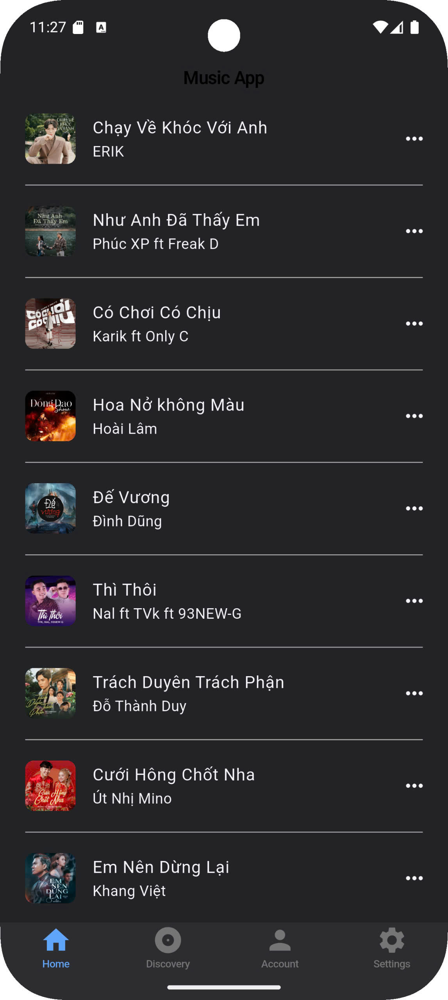
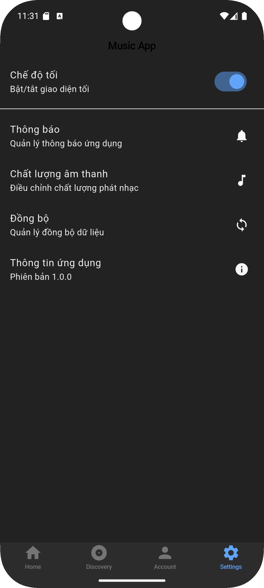

## Group 12 - Project: Music App 
## Members:
Đinh Xuân Quyền 22010342

Phan Văn Tình 22010122

Tạ Văn Thanh 22010161

## Introduction
Ứng dụng nghe nhạc cơ bản, người dùng sẽ có các chức năng nghe và phát nhạc, tạo danh sách các bài hát  
### UI

  
  
  
  

### Dark mode

  
  
  
  

# Structural Diagram
## UML diagram 

## Sequence diagram
Chức năng tạo danh sách bài hát

Chức năng xóa bài hát khỏi danh sách 

Chức năng phát và dừng nhạc

Chức năng tua bài hát

Chức năng chọn bài kế tiếp

Chức năng lặp lại bài hát

## Activity Diagram
Chức năng tạo danh sách bài hát

Chức năng thêm bài hát vào danh sách phát 

Chức năng xóa bài hát khỏi danh sách 

Chức năng phát nhạc

Chức năng dừng nhạc

Chức năng tua bài hát

Chức năng chọn bài kế tiếp

Chức năng lặp lại bài hát

## Class Diagram

Class User {
  int UserId;

  String name;
}

Class Playlist{  
  int playlistId;

  int UserID;

  String playlistName;
  
  List<Song> songs;       
}

Class Song {
  String ID;
  
  String title;         
  
  String artist;   
  
  int duration;    
  
  String image;    
  
  String album;        
  
  String source;  
}

Class Player{
  Song currentSong;

  int volume;

  boolean isPlaying;
}

Class Album{
  int albumID;

  String albumName;

  String artist;

  List<Song> songs;
}

Class PlaylistManager{
  List<Playlist> playlists;
}