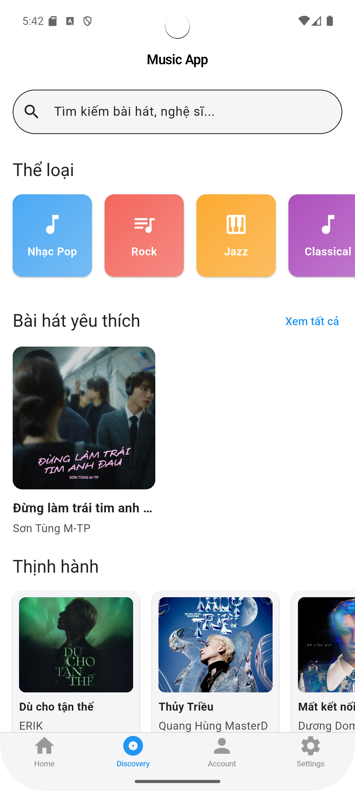

# Group 12 - Project: Music App

## Members:
- **Đinh Xuân Quyền** – 22010342
- **Phan Văn Tình** – 22010122
- **Tạ Văn Thanh** – 22010161

---
 
## Introduction

Chào mừng bạn đến với **Music App**, một ứng dụng nghe nhạc đơn giản được xây dựng bằng **Flutter**. Mục tiêu của dự án là giúp người dùng trải nghiệm phát nhạc một cách tiện lợi. Dưới đây là một số tính năng nổi bật:

- **Quản lý Playlist**: Tạo mới, xóa, thêm và gỡ bài hát khỏi playlist.
- **Phát Nhạc**: Phát, tạm dừng, chuyển bài, lặp lại bài hát hoặc toàn bộ playlist.
- **Yêu Thích (Favorites)**: Đánh dấu các bài hát yêu thích và quản lý danh sách yêu thích.
- **Phát Ngẫu Nhiên (Shuffle)**: Bật/tắt chế độ phát nhạc ngẫu nhiên.
- **Tích Hợp Firebase**: Lưu trữ và truy xuất dữ liệu bài hát từ **Firebase**, đảm bảo khả năng mở rộng và quản lý dữ liệu dễ dàng.

Dự án sử dụng các gói Flutter phổ biến, được khai báo trong tệp `pubspec.yaml`:

- **[shared_preferences](https://pub.dev/packages/shared_preferences)**: Lưu trữ dữ liệu cục bộ (như cài đặt, trạng thái yêu thích) trên thiết bị.
- **[provider](https://pub.dev/packages/provider)**: Quản lý trạng thái (state management) trong ứng dụng.
- **[cupertino_icons](https://pub.dev/packages/cupertino_icons)**: Cung cấp bộ biểu tượng theo phong cách iOS.
- **[http](https://pub.dev/packages/http)**: Hỗ trợ gửi và nhận yêu cầu HTTP (chẳng hạn lấy thông tin bài hát, hình ảnh).
- **[just_audio](https://pub.dev/packages/just_audio)**: Xử lý phát nhạc (play, pause, skip, repeat).
- **[rxdart](https://pub.dev/packages/rxdart)**: Cung cấp các tiện ích lập trình phản ứng (reactive programming), giúp xử lý luồng dữ liệu (streams) hiệu quả hơn.
- **[audio_video_progress_bar](https://pub.dev/packages/audio_video_progress_bar)**: Hiển thị thanh tiến trình phát nhạc/video có thể tương tác (seek, hiển thị buffer).

Bạn có thể tìm thấy phần triển khai chi tiết trong file `now_playing.dart`, nơi định nghĩa giao diện và logic cho màn hình đang phát nhạc (Now Playing). Các **Use Case** chính của hệ thống được mô tả trong [sơ đồ Use Case](#) (xem phần bên dưới), giúp bạn hình dung rõ ràng cách người dùng tương tác với ứng dụng.

## Installation & Setup

### 1. Chuẩn bị môi trường
- Cài đặt **Flutter** (phiên bản 3.0 trở lên).
- Cài đặt **Dart** (phiên bản 2.17 trở lên).
- IDE đề xuất: **Android Studio** hoặc **Visual Studio Code**.

### 2. Tích hợp Firebase (tùy chọn)
- Tạo một dự án mới trên [Firebase Console](https://console.firebase.google.com/).
- Thêm ứng dụng Android/iOS (tạo `google-services.json` hoặc `GoogleService-Info.plist`).
- Đưa file cấu hình Firebase vào đúng vị trí trong dự án Flutter:
  - `android/app/google-services.json`
  - `ios/Runner/GoogleService-Info.plist`
- Cài đặt các gói liên quan Firebase trong `pubspec.yaml` nếu cần (ví dụ: `firebase_core`, `cloud_firestore`, v.v.).

## Tải về mã nguồn

Bạn có thể tải mã nguồn của dự án bằng một trong các cách sau:

### 1️⃣ Tải về dưới dạng ZIP
- Truy cập [MobileAppDev_N05_Group12](https://github.com/dinhquyn/MobileAppDev_N05_Group12)
- Nhấn vào nút **"Code"** (màu xanh)
- Chọn **"Download ZIP"**
- Giải nén file và sử dụng mã nguồn

### 2️⃣ Clone bằng Git
Nếu bạn có Git trên máy, bạn có thể chạy lệnh sau trong terminal hoặc cmd:

git clone https://github.com/dinhquyn/MobileAppDev_N05_Group12.git

---

### User Interface
<p align="center">
  
  
  
  
  
</p>

### Dark mode
<p align="center">
  
  
  
  
  
  
</p>

---
# Structural Diagram


Đây là sơ đồ lớp (structural/class diagram) cho ứng dụng **Music Player**, thể hiện các lớp chính và cách chúng liên kết với nhau:

- **Song**
  - Thuộc tính:
    - `ID` (String) – Mã định danh bài hát.
    - `title` (String) – Tựa đề bài hát.
    - `image` (String) – Đường dẫn ảnh bìa.
    - `artist` (String) – Tên nghệ sĩ.
    - `duration` (int) – Thời lượng phát (tính bằng giây).
  - Mỗi **Song** có thể thuộc về một **Album** (thông qua thuộc tính `albumID`).

- **Album**
  - Thuộc tính:
    - `albumID` (int) – Mã định danh album.
    - `albumName` (String) – Tên album.
    - `artist` (String) – Nghệ sĩ của album.
    - `songs` (List<Song>) – Danh sách bài hát thuộc album.
  - Phương thức (gợi ý):
    - `addSong(Song song)` – Thêm một bài hát vào album.
    - `removeSong(Song song)` – Gỡ bài hát khỏi album.

- **User**
  - Thuộc tính:
    - `UserID` (int) – Mã định danh người dùng.
    - `name` (String) – Tên người dùng.
  - Phương thức (gợi ý):
    - `createPlaylist(...)` – Tạo playlist mới (được gọi qua `PlaylistManager`).
    - `removePlaylist(...)` – Xoá playlist (được gọi qua `PlaylistManager`).

- **Playlist**
  - Thuộc tính:
    - `playlistID` (int) – Mã định danh playlist.
    - `name` (String) – Tên playlist.
    - `songs` (List<Song>) – Danh sách bài hát thuộc playlist.
  - Phương thức:
    - `addSong(Song song)` – Thêm một bài hát vào playlist.
    - `removeSong(Song song)` – Gỡ bài hát khỏi playlist.

- **PlaylistManager**
  - Thuộc tính:
    - `playlistList` (List<Playlist>) – Danh sách các playlist mà người dùng quản lý.
  - Phương thức:
    - `createPlaylist(int playlistID, String name)` – Tạo playlist mới.
    - `deletePlaylist(int playlistID)` – Xoá playlist theo ID.
    - `addSong(Song song)` – Thêm bài hát vào một playlist.
    - `removeSong(Song song)` – Gỡ bài hát khỏi một playlist.
    - `skip()` / `next()` – chuyển bài trong playlist.
    - `repeat()` – Kích hoạt chế độ lặp lại.

- **Player**
  - Thuộc tính:
    - `currentSong` (Song) – Bài hát hiện đang phát.
    - `volume` (int) – Mức âm lượng.
    - `isPlaying` (boolean) – Trạng thái đang phát hay không.
  - Phương thức:
    - `play(Song song)` – Phát một bài hát.
    - `pause()` – Tạm dừng bài hát đang phát.
    - `skip()` – Bỏ qua bài hát hiện tại.
    - `next()` – Chuyển sang bài tiếp theo (nếu có).
    - `repeat()` – Bật chế độ lặp lạ.

### Mối Quan Hệ Giữa Các Lớp

- **User** sở hữu nhiều **Playlist**.
- **Playlist** chứa nhiều **Song**.
- **Album** chứa nhiều **Song**.
- **Player** chịu trách nhiệm phát nhạc, tham chiếu đến bài hát hiện tại (`currentSong`).
- **PlaylistManager** đóng vai trò trung gian trong việc tạo/xoá playlist và quản lý danh sách bài hát trong playlist.
---
## UML diagram
# User Case
Dưới đây là sơ đồ **Use Case** minh họa các chức năng chính mà **Người dùng (User)** có thể thực hiện trong ứng dụng nghe nhạc:


- **UC1.1 Create Playlist**: Tạo mới một playlist để quản lý các bài hát yêu thích.
- **UC1.2 Delete Playlist**: Xoá playlist không còn sử dụng.
- **UC1.3 Add Song to Playlist**: Thêm bài hát vào playlist.
- **UC1.4 Remove Song from Playlist**: Gỡ bài hát khỏi playlist.

- **UC2.1 Play Song**: Phát một bài hát đã chọn.
- **UC2.2 Pause Song**: Tạm dừng bài hát đang phát.
- **UC2.3 Skip/Next Song**: Bỏ qua bài hát hiện tại, chuyển sang bài tiếp theo.
- **UC2.4 Repeat Song**: Bật chế độ lặp lại cho bài hát hoặc playlist.

## Nhóm chức năng

- **Nhóm chức năng 1: Quản lý playlist (UC1.x)**: Người dùng có thể tạo, xóa, thêm và gỡ bài hát trong playlist. Các thao tác này giúp tổ chức và tùy biến danh sách nhạc theo sở thích cá nhân.
- **Nhóm chức năng 2: Điều khiển phát nhạc (UC2.x)**: Người dùng có thể phát, tạm dừng, chuyển bài, hoặc bật chế độ lặp lại. Các chức năng này đảm bảo trải nghiệm nghe nhạc thuận tiện và linh hoạt.

Sơ đồ Use Case này cung cấp cái nhìn tổng quan về cách **Người dùng** tương tác với hệ thống. Mỗi Use Case sẽ tương ứng với những thao tác cụ thể được triển khai trong mã nguồn (như các nút Play, Pause, Skip, hoặc chức năng tạo playlist, thêm/xóa bài hát, v.v.). 

---
# Sequence & Activity Diagrams

Dưới đây là các **Sequence Diagram** và **Activity Diagram** minh họa cho những chức năng chính trong dự án **Music App**.

---
## Sequence Diagram

**Sequence Diagram** thể hiện trình tự (thời gian) của các lời gọi phương thức (messages) giữa các thành phần trong hệ thống khi thực hiện một chức năng cụ thể.

### 1. Create Playlist (Tạo danh sách bài hát)
Cho thấy quy trình người dùng tạo một playlist mới, bao gồm việc nhập thông tin và hệ thống khởi tạo danh sách.


### 2. Delete Song from Playlist (Xóa bài hát khỏi danh sách)
Minh họa cách người dùng chọn bài hát cần xóa, hệ thống xác nhận và cập nhật lại playlist.


### 3. Play and Pause Music (Phát và dừng nhạc)
Mô tả luồng tương tác khi người dùng nhấn **Play** để phát nhạc hoặc **Pause** để tạm dừng, cũng như cách hệ thống xử lý trạng thái phát nhạc.


### 4. Seek Song (Tua bài hát)
Cho thấy quá trình người dùng tua đến một vị trí mới trong bài hát, hệ thống cập nhật và tiếp tục phát từ vị trí đó.


### 5. Next Song (Chọn bài kế tiếp)
Biểu diễn thao tác **Skip/Next** để bỏ qua bài hát hiện tại, xác định và phát bài tiếp theo trong danh sách (hoặc ngẫu nhiên nếu bật Shuffle).


### 6. Repeat Song (Lặp lại bài hát)
Minh họa cách người dùng bật chế độ **Repeat** (một bài hoặc cả playlist), và hệ thống sẽ tự động phát lại khi bài hát kết thúc.


---

## Activity Diagram

**Activity Diagram** tập trung vào luồng công việc (workflow) của mỗi chức năng, bao gồm các bước thực hiện, điều kiện rẽ nhánh (nếu có) và kết quả cuối cùng.

### 1. Create Playlist (Tạo danh sách bài hát)
Cho thấy các bước người dùng nhập thông tin, xác nhận và khởi tạo playlist mới.


### 2. Add Song to Playlist (Thêm bài hát vào danh sách phát)
Minh họa việc người dùng chọn bài hát muốn thêm, hệ thống kiểm tra và đưa bài hát vào playlist.


### 3. Delete Song from Playlist (Xóa bài hát khỏi danh sách)
Cho thấy quy trình xác định bài hát cần xóa, xác nhận và cập nhật lại playlist sau khi xóa.


### 4. Play Music (Phát nhạc)
Mô tả cách hệ thống chuyển sang trạng thái phát nhạc khi người dùng chọn **Play**.


### 5. Stop/Pause Music (Dừng nhạc)
Biểu diễn thao tác **Pause** hoặc **Stop** để tạm dừng bài hát, cùng việc hệ thống cập nhật trạng thái phát nhạc.


### 6. Seek Song (Tua bài hát)
Minh họa quá trình người dùng tua đến một mốc thời gian khác, hệ thống xử lý và tiếp tục phát từ mốc mới.


### 7. Next Song (Chọn bài kế tiếp)
Biểu diễn thao tác **Next** hoặc **Skip** để chuyển sang bài khác trong danh sách, cập nhật và phát bài tiếp theo.


### 8. Repeat Song (Lặp lại bài hát)
Trình bày cách hệ thống xử lý khi bật chế độ **Repeat** (một bài hoặc cả playlist) và tự động phát lại.


___

## Class Diagram

Dưới đây là phần mô tả sơ lược các lớp chính trong ứng dụng **Music App**, .

---

### Lớp Song
```dart
class Song {
  String? id;
  String? title;
  String? album;
  String? artist;
  String? source;
  String? image;
  int? duration;

  Song({
    this.id,
    this.title,
    this.album,
    this.artist,
    this.source,
    this.image,
    this.duration,
  });
}
